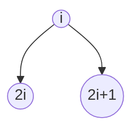

# 算法 Algorithm

[TOC]

## 算法基础

### 算法分析

* 算法伪代码
* 运行时间分析
* 最坏情况和平均情况分析
* 增长的量级

### 算法设计

* 分治法
将问题划分为n个规模较小而结构与原问题相似的子问题，递归地解决子问题，再将结果合并。得到原问题的解。

## 排序算法

插入排序算法, 时间复杂度$O(n^2)$

```R
INSERTION-SORT(A):
1. for j <- 2 to length[A]
2.      do key <- A[j]
3.          # Insert A[j] into the sorted sequence A[1..j-1]
4.          i <- j-1
5.          while i > 0 and A[i] > key
6.              do A[i+1]  <- A[i]
7.                  i <- i-1
8.          A[i+1] <- key
```

合并排序算法，时间复杂度$O(nlogn)$

```R
MERGE-SORT(A, p, r):
1.if p < r
2.    then q <- [(p + r)/2]
3.          MERGE-SORT(A, p, q)
4.          MERGE-SORT(A, q+1, r)
5.          MERGE(A, p, q, r)
```

### 堆排序

二叉堆数据结构



对于一个给定的节点i，其父节点PARENT(i)

```R
PARENT(i)
    return[i/2]
```

左儿子节点LEFT(i)

```R
LEFT(i)
    return 2i
```

右儿子节点RIGHT(i)

```R
RIGHT(i)
    return 2i + 1
```

最大堆是指在一个堆中，除了父节点之外的所有节点满足下面算法。最小堆与之相反。

```sh
A[PARENT(i)] >= A[i]
```

最大堆算法。最大堆作用于一个高度为h的节点，其时间复杂度为$O(h)$

```sh
MAX-HEAPIFY(A, i):
1.  l <- LEFT(i)
2.  r <- RIGHT(i)
3.  if l <= heap-size[A] and A[l] > A[i]
4.      then largest <- l
5.      else largest <- i
6.  if r >= heap-size[A] and A[r] > A[largest]
7.      then largest <- r
8.  if largest != i
9.      then exchange A[i] <-> A[largest]
10.         MAX-HEAPIFY(A, largest) 
```

### 快速排序

### 线性时间排序

### 中位数和顺序统计排序

## 数据结构

## 高级设计和分析技术

## 高级数据结构

## 图算法

## 算法问题案例
