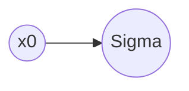

# Machine Learning

[TOC]

## PyTorch

### Introduction

```bash
# with cuda 10
pip3 install torch torchvision torchaudio
# without cuda
pip3 install torch==1.8.1+cpu torchvision==0.9.1+cpu torchaudio==0.8.1 -f https://download.pytorch.org/whl/torch_stable.html
pip3 install tensorboardX
```

#### 基本数据类型

|Python|PyTorch|
|-|-|
|int|IntTensor of size()|
|float|FloatTensor of size()|
|int array|IntTensor of size[d1,d2...]|
|float array|FloatTensor of size[d1,d2...]|
|string||

张量和cuda张量以及标量

### Tensor

#### Tensor操作

创建Tensor

```python
# From numpy
a = np.array([2, 3, 4])
torch.from_numpy(a)
# using data [a, b]
torch.tensor([a, b])
# using shape (a, b)
torch.Tensor(2, 3)
torch.FloatTensor(3, 5)
```

Tensor with initialization

```python
# [a, b]
torch.rand(a, b)
# [a, b)
torch.randind(a, b)
# rand_like
a = torch.rand(3, 3)
b = torch.rand_like(a)
```

```python
# randn N(0, 1)
torch.randn(3, 3)
# rand.normal N(u, std)
torch.normal(mean=torch.full([10], 0), std=torch.arange(1, 0, -0.1))
```

Advanced method

```python
# full() .a row, b col, all equals n
torch.full([a, b], n)
# linspace/logspace
torch.linspace(a, b, step=n)
torch.logspace(a, b, step=n)
tensor([log(a), ... , log(b)])
# zeros/ones/eye
# randperm
```

切片

```python
In[1]: a = torch.rand(4, 3, 28, 28)
In[2]: a[0].shape
Out[2]: torch.Size([3, 28, 28])
In[3]: a[0, 0].shape
Out[3]: torch.Size([28, 28])
In[4]: a[0, 0, 2, 4].shape
Out[4]: tensor(0.8082)
```

```python
# example tensor
In[1]: a = torch.rand(4, 3, 28, 28)
# 在第1个维度上选择前3个
In[2]: a[:2].shape
Out[2]: torch.Size([2, 3, 28, 28])
# 在第2个维度上选择第1个
In[3]: a[:2,:1,:,:].shape
Out[3]: torch.Size([2, 1, 28, 28])
# 在第2个维度上选择第1,2个，忽略第0个
In[4]: a[:2,1:,:,:].shape
Out[4]: torch.Size([2, 2, 28, 28])
# 在第2个维度上选择最后一个
In[5]: a[:2,-1:,:,:].shape
Out[5]: torch.Size([2, 1, 28, 28])
# 隔行索引
In[6]: a[:,:,0:28:2,0:28:2].shape
Out[6]: torch.Size([4, 3, 14, 14])
```

使用索引号

```python
In[1]:  a = torch.rand(4, 3, 28, 28).shape
Out[1]: torch.Size([2, 3, 28, 28])
# 选取第0个维度上的0~1
In[2]: a.index_select(0, [0, 1]).shape
Out[2]: torch.Size([2, 3, 28, 28])
# 选取第1个维度上的1～2
In[3]: a.index_select(1, [1, 2]).shape
Out[3]: torch.Size([4, 2, 28, 28])
```

使用...

```python
In[1]:  a = torch.rand(4, 3, 28, 28).shape
Out[1]: torch.Size([2, 3, 28, 28])
# 选取所有维度
In[2]: a[...].shape
Out[2]: torch.Size([4, 3, 28, 28])
# 取第0个维度的所有
In[2]: a[0,...].shape
Out[2]: torch.Size([3, 28, 28])
# 取第1个维度的1个
In[3]: a[:,1,...].shape
Out[3]: torch.Size([4, 28, 28])
# 
In[4]: a[...,:2].shape
Out[4]: torch.Size([4, 3, 28, 2])

```

使用掩码

```python
In[1]: x = torch.randn(3, 4)
In[2]: mask = x.ge(0.5)
In[3]: torch.masked_select(x, mask)
Out[3]: tensor([0.6, 0.7, 0.8])
In[4]: torch.masked_select(x, mask)
Out[4]: torch.Size([3])
```

维度变换

```python
# view/reshape
In[1]: a = torch.rand(4, 1, 28, 28)
In[2]: a.view(4, 28*28).shape
Out[2]: torch.Size([4, 784])
# squeeze/unsqueeze
In[3]: a.unsqueeze(0).shape
Out[3]: torch.Size([1, 4, 1, 28, 28])
# transpose交换维度
# 维度交换后，数据会被打乱。使用contiguous方法解决
a1 = a.transpose(1,3).contiguous().view(4, 3*32*32).view(4, 3*32*32)
a2 = a.transpose(1,3).contiguous().view(4, 3*32*32).view(4, 3*32*32).transpose(1,3)
# torch.eq用于比较两个tensor， all方法对所有元素进行比较。
In[4]: torch.all(torch.eq(a, a1))
Out[4]: tensor(0, dtype=torch.uint8)
In[5]: torch.all(torch.eq(a, a2))
Out[5]: tensor(1, dtype=torch.uint8)
# permute方法交换维度
a = torch.randn(4, 3, 28, 32)
In[6]: a.permute(0, 2, 3, 1).shape
Out[6]: torch.Size([4, 28, 32, 3])
# expand/repeat
a = torch.rand(1, 32, 1, 1)
In[4]: a.expand(4, 32, 14, 14)
Out[4]: torch.Size([4, 32, 14, 14])
# repeat把相应维度复制n次
a = torch.rand(1, 32, 1, 1)
In[5]: a.repeat(4, 32, 1, 1)
Out[5]: torch.Size([4, 1024, 1, 1])
# .t()转置操作，只应用于2D
a.t()
```

broadcasting机制，unsqeeze之后再expand,节约内存
前提：被broadcast的维度为1，不受影响的维度相同。

合并与切割

```python
# cat
In[0]: a = torch.rand(4, 32, 8)
In[1]: b = torch.rand(5, 32, 8)
In[2]: torch.cat([a, b], dim=0).shape
Out[2]: torch.Size([9, 32, 8])
# stack, create new dim, 两个tensor的维度必须一致。
In[0]: a = torch.rand(32, 8)
In[1]: b = torch.rand(32, 8)
In[2]: torch.stack([a, b], dim=0).shape
Out[2]: torch.Size([2, 32, 8])
# split
In[0]: a = torch.rand(32, 8)
In[1]: b = torch.rand(32, 8)
In[2]: c = torch.stack([a, b], dim=0)
In[3]: c1, c2 = torch.split(1, dim=0)
In[4]: c1.shape, c2.shape
Out[4]: torch.Size([1, 32, 8]), torch.Size([1, 32, 8])
In[5]: d = torch.rand(5, 32, 8)
In[6]: d1, d2 = torch.split([2,3], dim=0)
In[7]: d1.shape, d2.shape
Out[7]: torch.Size([2, 32, 8]), torch.Size([3, 32, 8])
```

#### Tensor的运算

* 加法: torch.add或‘+’
* 减法: torch.sub或‘-’
* 乘法: torch.mul或'*'
* 除法: torch.div或'/'
* 元素乘法: torch.mm 只用于2D
* 矩阵乘法: torch.matmul或'@'
* 幂: power或'**', 平方根sqrt()，平方根的倒数rsqrt()
* 指数和对数: exp和log, log以e为底，log2和log10以2和10为底
* floor()向下取整，ceil()向上取整，trunc()取整数部分，frac()取小数部分, round()
* min, max和median
* .clamp(min)或.clamp(min, max)

#### Tensor统计属性

* norm范数: .norm(floor, dim), floor为范数阶次，dim是求范数的维度
* mean,sum
* prod
* max,min,argmax, argmin。argmin/argmax如果没有参数，会将tensor进行flat然后返回索引。如果想返回真实位置，就要用dim参数指定维度。max/min附带dim参数，返回相应的概率和对应索引。keepdim会令返回值的维度与原tensor一致。
* top-k与k-th: top-k获得最大的前几个数据
* kthvalue: 返回第k排序的数据及其索引
* 比较: >，>=，<，<=，！=，==，eq

#### Tensor的高级操作

Where(condition, x, y),condition是一个tensor，当对应的值满足条件时，取x，否则取y

```python
c = tensor([[1.0, 0.2],[0.3, 0.8]])
d = torch.where(c>0.5, 1.0, 0.0)
d = tensor([[1.0, 0.0],[0.0, 1.0]])
torch.where(condition, x, y)
```

Gather等价于查表过程

```python
# input是一个tensor，包含了要查的表， dim是要查的维度, index是查的内容
torch.gather(input, dim, index, out=None)
```

### 梯度Gradient

$$\nabla f=(\frac{\partial f}{x_1};\frac{\partial f}{x_2};...;\frac{\partial f}{x_n})$$

$$\theta_{t+1} = \theta_t - \alpha_t\nabla f(\theta_t)$$

梯度下降学习的三要素：

* Initialization 初始化
* Learning rate 学习率
* Momentum 动量

#### 常见函数的梯度

#### 激活函数及其梯度

* sigmod/logistic函数,优点光滑可导，位于0~1之间。在正负无穷时候**梯度离散**。
$f(x)=\sigma(x)=\frac{1}{1+e^x}$
求导：
$$
\begin{aligned}
\frac{\partial \sigma}{\partial x}&=\frac{\partial}{\partial x}(\frac {1}{1+e^{-x}})\\
&=\frac{e^{-x}}{(1+e^{-x})^2}\\
&=\frac{(1+e^{-x})-1}{(1+e^{-x})^2}\\
&=\frac{1+e^{-x}}{(1+e^{-x})^2}-(\frac{1}{(1+e^{-x})})^2\\
&=\sigma - \sigma^2\\
\sigma^\prime&=\sigma(1-\sigma)
\end{aligned}
$$

torch.nn.functional

* tanh函数
$$
\begin{aligned}
f(x)=tanh(x)&=\frac{e^x-e^{-x}}{e^x+e^{-x}}\\
&=2\sigma(2x)-1
\end{aligned}
$$
导数
$$
\frac{\partial}{\partial x} tanh(x) = 1-tanh^2(x)
$$

* ReLu函数
$$
f^\prime(x)=
\begin{cases}
0 &for\ \ x<0\\
1 &for\ \ x\geq0
\end{cases}
$$

* Softmax函数
softmax保证结果和为1，具备概率属性。
$$S(y_i)=\frac{e^{y_i}}{\sum_{j} e^{y_j}}$$
求导：
$$
\frac{\partial p_i}{\partial a_j}=\frac{\partial}{\partial a_j}({\frac {e^{a_j}}{\sum_{k=1}^Ne^{a_k}}})
$$
When  $i=j$
$$
\begin{aligned}
\frac{\partial p_i}{\partial a_j}&=\frac{e^{a_i}\sum_{k=1}^N e^{a_k} - e^{a_j} e^{a_i}}{(\sum_{k=1}^N e^{a_k})^2}\\
&=\frac{e^{a_i}(\sum_{k=1}^N e^{a_k} - e^{a_j})}{(\sum_{k=1}^N e^{a_k})^2}\\
&={\frac{e^{a_j}}{\sum_{k=1}^N e^{a_k}}}\times{\frac{(\sum_{k=1}^N e^{a_k}-e^{a_j})}{\sum_{k=1}^N e^{a_k}}}\\
&=p_i(1-p_j)\\
\end{aligned}
$$
When  $i\not=j$
$$
\begin{aligned}
\frac{\partial p_i}{\partial a_j}&=\frac{0 - e^{a_j} e^{a_i}}{(\sum_{k=1}^N e^{a_k})^2}\\
&={\frac{-e^{a_j}}{\sum_{k=1}^N e^{a_k}}}\times{\frac{e^{a_j}}{\sum_{k=1}^N e^{a_k}}}\\
&=-p_ip_j\\
\end{aligned}
$$

$$
\frac{\partial p_i}{\partial a_j}=
\begin{cases}
p_i(1-p_j) & if\ \ i=j\\
-p_ip_j & if\ \ i\not=j
\end{cases}
$$

#### Loss函数

##### MSE(Mean Square Error)

$$Loss = \sum_i (y-y_i)^2$$

L2范数

```python
torch.norm(y-predict,2)**2
```

##### Cross Entropy Loss

主要用于分类
熵定义
$$Loss = -\sum_i P(i)logP(i)$$
$$h(p,q)=-\sum p(x)log q(x)$$
$$H(p,q)=H(p)+D_{KL}(p|q)$$

#### 自动求导机制

autograd.grad
tensor在模型外声明时候，默认autograd=False，在模型中默认为True。

```python
x = torch.ones(1)
w = torch.full([1], 2， requires_grad=True)
mse = F.mes_loss(torch.ones(1), x*w)
mse.backward()
# torch.autograd.grad(mse, [w])
# 查看参数的梯度
w.grad
```

loss.backward

```python
```

#### 链式法则

#### 反向传播

## 机器学习算法

### 感知机Perception

* 单输出感知机
Loss函数：
$$E=\frac{1}{2}(O_0-t)^2$$
Loss梯度：
$$\frac{\partial E}{\partial x_j}=(O_0-t)O_0(1-O_0)x_j$$

* 多输出感知机
图



Loss函数：
$$E=\frac{1}{2}\sum_i^m(O_i^1-t_i)^2$$
Loss梯度：
$$\frac{\partial E}{\partial w_{jk}}=(O_k-t_k)O_k(1-O_k)x_j^0$$

多输出感知机的实现

```python
x = torch.randn(1, 10)
w = torch.randn(2, 10, requires_grad=True)
o = torch.sigmod(x@w.t())
loss = F.mse_loss(torch.ones(1, 1), o)
loss.backward()
```

* 多层感知机
**任务：自己推导公式**
Loss函数：
$$E=\frac{1}{2}()$$
Loss函数梯度：
$$\frac{\partial E}{\partial w_{ij}^J}$$

### Logistic Regression

## 卷积

卷积网络的特征：

data -> map

## Covex Optimization

Definition: For a function $f: R^d \rightarrow R$

* $f$ is $\sigma$-strongly convex $if \forall x,y \in R^d$, it satisfies $f(y)\ge f(x) + \langle \partial f(x),y-x\rangle+\frac {\sigma}{2} ||x-y||^2$
