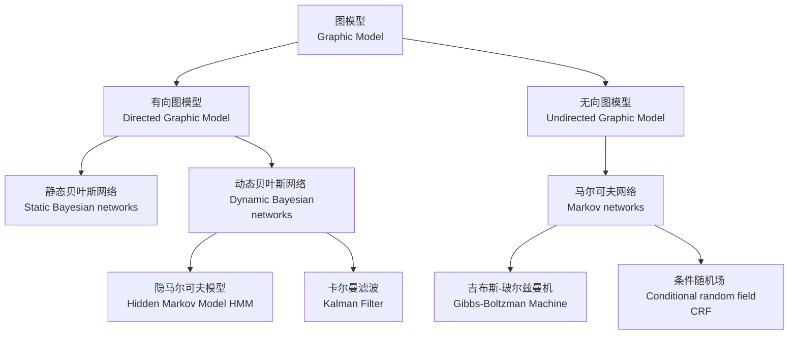
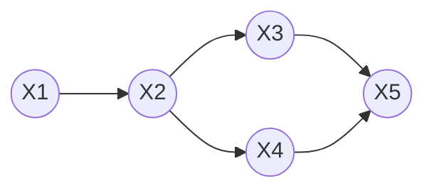
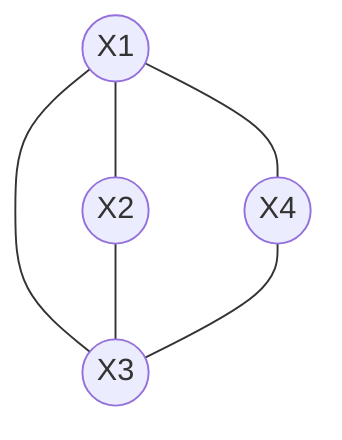

# PGM

## 概率图模型

```mermaid
graph TB
    subgraph Naive-Bayesian
        style Naive-Bayesian fill:#ffffff
            A(( ))
            B(( ))
            C(( ))
            D(( ))
            A --> B
            A --> C
            A --> D
            style A fill:#000000
            style B fill:#ffffff
            style C fill:#ffffff
            style D fill:#ffffff
            end

    subgraph HMM
        subgraph  
            E(( ))
            F(( ))
            G(( ))
            end
        subgraph  
            H(( ))
            I(( ))
            J(( ))
            end
        style E fill:#f9f
        style HMM fill:#ffffff
        end
```

### 有向图与无向图

#### 有向图

上图的联合概率
$P(x_1,x_2,...,x_n)=P(x_1)P(x_2|x_1)P(x_3|x_2)P(x_4|x_2)P(x_5|x_3,x_4)$

#### 无向图

团的概念：
$$P(Y)=\frac{\prod_{c} \Psi_c(Y_c)}{Z(x)}$$
其中:
$$Z(x)=\sum_{Y}{\prod_{c}{\Psi_c(Y_c)}}$$
$$\Psi_c(Y_c)=e^{-E(Y_c)}=e^{\sum_k {\lambda_kf_k(c,y|c,x)}}$$

### 齐次马尔可夫假设

在⼀个过程中，每个状态的转移只依赖于前n个状态，并且只是个n阶的模
型。最简单的⻢尔科夫过程是⼀阶的，即只依赖于前⼀个状态。

### 贝叶斯网络

### 高斯混合模型

### 隐马尔可夫模型

### 卡尔曼滤波

### 粒子滤波

### CRF条件随机场

### EM算法

输入：观察到的数据$x=(x_1,x_2,\dots,x_n)$，联合分布$p(x,z;\theta)$，条件分布$p(z|x,\theta)$ ，最大迭代次数J。

算法步骤：

（1）随机初始化模型参数$\theta$的初值$\theta_0$。

（2）$j=1,2,\dots,J$ 开始EM算法迭代：

E步：计算联合分布的条件概率期望：
$$Q_i(z_i)=p(z_i|x_i,\theta_i)$$

$$l(\theta,\theta_j)=\sum_{i=1}^n \sum_{z_i} Q_i(z_i)log{p(x_i,z_i;\theta) \over Q_i(z_i)}$$

M步：极大化$l(\theta,\theta_j)$,得到$\theta_{j+1}$ :
$$\theta_{j+1}=argmax[l(\theta,\theta_j)]$$

如果$\theta_{j+1}$已经收敛，则算法结束。否则继续进行E步和M步进行迭代。
输出：模型参数$\theta_0$。

EM算法的解释：
对于高斯混合模型，其概率密度函数为：
$$p(x_i|\theta)=\sum_{l=1}^k \alpha_{l} N(\mu_l,\sigma_l)$$
如果是其它概率模型，也可以写出相应的概率密度函数。
如果要求其参数值，通过MLE方法可以求得：
$$\theta_{MLE}=argmax(\sum_{i=1}^N {log[\sum_{l=1}^k {\alpha_l N(\mu_l,\sigma_l)}]})$$
这个方程很难求解，因此需要寻找更简单的方法来求解。通过引入隐变量$z_i$简化方程求解。在不同的概率模型中$z_i$有不同的含义。
$$p(x_i)=\int_z{p(x_i|z_i)p(z_i)dz_i}$$
在高斯混和模型中是
$$p(x_i)=\sum_{z_i=1}^k{\alpha_{z_i}N(x_i|\theta_{z_i})}$$

$$
\begin{aligned}
E[logp(x|\theta)]&=E[logp(x,z|\theta)-logp(z|x,\theta)]\\
logp(x|\theta)&=\int_{z}logp(x,z|\theta)p(x,z|\theta^{(g)})dz-\int_{z}logp(z|x,\theta)p(z|x,\theta^{(g)})dz\\
&=Q(\theta,\theta^{(g)})-H(\theta,\theta^{(g)})
\end{aligned}
$$
### Vertbi算法

### 高斯分布(Gaussian Distribution)

贴图，高斯分布

对于：$X=(x_1,x_2,...,x_n)^T=\begin{pmatrix}x_1\\ x_2\\ \vdots \\x_n \end{pmatrix}$

$x_i \in R^p$
$x_i \sim N(\mu, \sigma)$

概率密度函数：$$p(x)=\frac {1} {\sqrt{2\pi}\sigma} exp(- {(x-\mu)^2 \over 2\sigma^2})$$
极大似然估计：
$$\mu_{MLE}={1 \over N} \sum_{i=1}^N {x_i}$$
有偏估计：
$$\sigma_{MLE}^2={1 \over N}\sum_{i=1}^N(x_i-\mu_{MLE})^2$$
无偏估计：
$$\hat{\sigma}_{MLE}^2={1 \over N-1}\sum_{i=1}^N(x_i-\mu_{MLE})^2={N-1 \over N} \sigma_{MLE}^2$$
