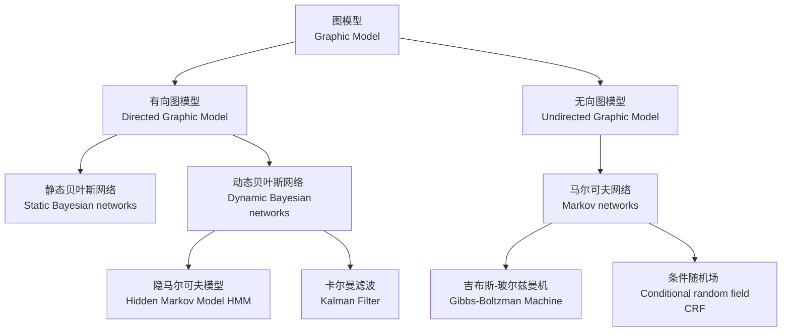
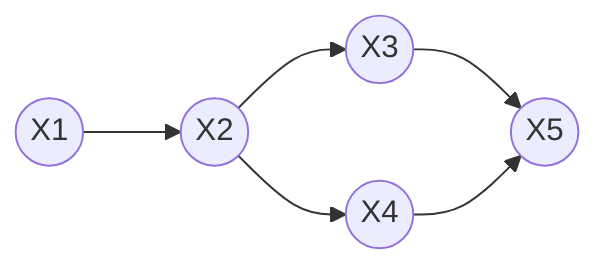
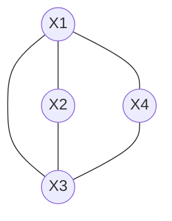
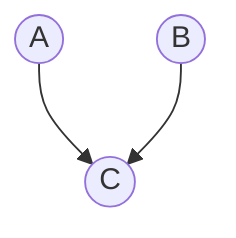
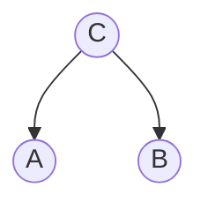
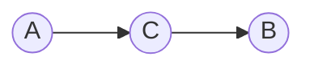
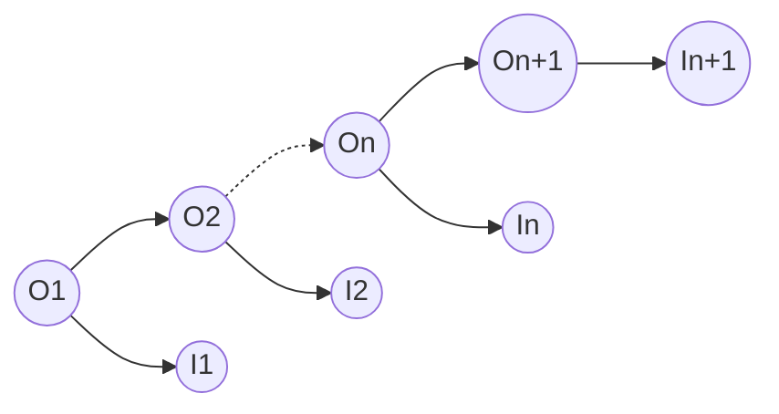

# 概率图模型

[TOC]

## 框架及概念

### 贝叶斯定理

事件A发生的条件下，事件B发生的概率，即“B条件下A的概率”，等于联合概率$P(A,B)$除以边缘概率$P(A)$。
$$P(B|A)={P(A,B) \over P(A)} $$

### 有向图

上图的联合概率
$P(x_1,x_2,...,x_n)=P(x_1)P(x_2|x_1)P(x_3|x_2)P(x_4|x_2)P(x_5|x_3,x_4)$

### 无向图

团的概念：
$$P(Y)=\frac{\prod_{c} \Psi_c(Y_c)}{Z(x)}$$
其中:
$$Z(x)=\sum_{Y}{\prod_{c}{\Psi_c(Y_c)}}$$
$$\Psi_c(Y_c)=e^{-E(Y_c)}=e^{\sum_k {\lambda_kf_k(c,y|c,x)}}$$

### 贝叶斯网络

令$G=(I,E)$表达一个有向无环图DAG。其中I表示所有的节点，E表示所有的边。令$X\in X_i,i \in I$为任意一个节点I所代表的随机向量，若节点X的联合概率可以表示为：
$$p(x)=\prod_{i \in I} {p(x_i|x_{pa(i)})}$$
则称X为相对于一个有向无环图G的贝叶斯网络。其中$pa(i)$表示i节点的父节点。

#### 贝叶斯网络的三种形式

贝叶斯网络由以下三种基本结构组成

##### Head-Head

对于下图的结构有：$P(a,b,c)=P(a)P(b)P(c|a,b)$

##### Head-Tail

对于下图的结构有：$P(a,b,c)=P(a|c)P(b|c)P(c)$

1. 当c未知时，a和b不独立
2. 当c已知时，有$P(a,b|c)={P(a,b,c) \over P(c)}$,得到$P(a,b|c)=P(a|c)P(b|c)$。即a,b独立。

##### Tail-Tail

对于下图的结构有：$P(a,b,c)=P(a)P(c|a)P(b|c)$

1. 当c未知时，$P(a,b,c)=P(a)P(c|a)P(b|c)$,无法推出$P(a,b)=P(a)P(b)$,即a,b不独立。
2. 当c已知时，有$P(a,b|c)={P(a,b,c) \over P(c)}$,得到$P(a,b|c)=P(a|c)P(b|c)$。即a,b独立。

马尔可夫链：即在$x_i$给定的条件下，$x_{i+1}$的分布与$x_1,x_2,\dots,x_{i-1}$条件独立。即$x_{i+1}$的分布只与$x_i$有关

#### 齐次马尔可夫假设

在⼀个过程中，每个状态的转移只依赖于前n个状态，并且只是个n阶的模
型。最简单的⻢尔科夫过程是⼀阶的，即只依赖于前⼀个状态。

## 动态贝叶斯网络

### 隐马尔可夫模型

假设Q是所有可能的隐藏状态的集合，V是所有可观测状态的集合。
$$Q=\{ q_1,q_2,\dots,q_N \},V=\{v_1,v_2,\dots,v_M\}$$
对于一个长度为T的序列，I对应其状态序列，O为观测序列。
$$I=\{i_1,i_2,\dots,i_T\},O=\{o_1,o_2,\dots,o_T\}$$
其中任意隐藏状态$i_t\in Q$，任意观测状态$o_t\in V$。

隐马尔可夫模型基于两个假设：

1. 齐次马尔可夫假设：任意时刻的状态转移概率为:$a_{ij}=P(i_{t+1}=q_j|i_t=q_i)$,组成状态转移矩阵A。
$$A=\begin{bmatrix}a_{ij}\end{bmatrix}_{N \times N}$$
2. 观测独立性假设：任意时刻观测量只取决于当前时刻的隐状态。$b_{j}(k)=P(o_t=v_k|i_k=q_j)$,组成发射矩阵B。
$$B=\begin{bmatrix}b_j(k)\end{bmatrix}_{N \times M}$$

另外需要初始状态矩阵，$\pi(i)=P(i_1=q_i)$
$$\Pi=\begin{bmatrix}\pi(i)\end{bmatrix}_N$$

这样，隐马尔可夫模型可以由以下参数组成：
$$\lambda=(A,B,\Pi)$$

#### HMM模型的三个基本问题

##### 求观测序列的概率-前后向算法

直接求解概率计算量过大，因此采用迭代的方法构造对T时刻观测变量的求解。
前向算法
定义一个概率：
$$\alpha_t(i)=P(o_1,\dots,o_t,i_t=q_i|\lambda)$$
T时刻的概率为：
$$\alpha_T(i)=P(O,i_t=q_i|\lambda)$$
应用边缘概率求：
$$P(O|\lambda)=\sum_{i=1}^N P(O,i_t=q_i|\lambda)=\sum_{i=1}^N \alpha_T(i)$$
$$
\begin{aligned}
\alpha_{t+1}(j)&=P(o1,\dots,o_t,o_{t+1},i_{t+1}=q_j|\lambda)\\
&=\sum_{i=1}^N P(o_1,\dots,o_t,o_{t+1},i_t=q_i,i_{t+1}=q_j|\lambda)\\
&=\sum_{i=1}^N P(o_{t+1}|o_1,\dots,o_t,i_t=q_i,i_{t+1}=q_j,\lambda)P(o_1,\dots,o_t,i_t=q_i,i_{t+1}=q_j|\lambda)\\
&=\sum_{i=1}^N P(o_{t+1}|i_{t+1}=q_j)P(o_1,\dots,o_t,i_t=q_i,i_{t+1}=q_j,\lambda)\\
&=\sum_{i=1}^N P(o_{t+1}|i_{t+1}=q_j)P(i_{t+1}=q_j|o_1,\dots,o_t,i_t=q_i,\lambda)P(o_1,\dots,o_t,i_t=q_i|\lambda)\\
&=\sum_{i=1}^N b_j(t+1)a_{ij}\alpha_t(i)
\end{aligned}
$$
后向算法：
类似前向算法，构造概率模型：
$$
\begin{aligned}
&\beta_t(i)=P(o_{t+1},\dots,o_T|i_t=q_i,\lambda)\\
&\dots\ \dots\\
&\beta_1(i)=P(o_2,\dots,o_T|i_1=q_i,\lambda)\\
\end{aligned}
$$

$$
\begin{aligned}
P(O|\lambda)&=P(o_1,\dots,o_T|\lambda)\\
&=\sum_{i=1}^N P(o_1,\dots,o_T,i_1=q_i|\lambda)\\
&=\sum_{i=1}^N P(o_1,\dots,o_T|i_1=q_i,\lambda)P(i_1=q_i|\lambda)\\
&=\sum_{i=1}^N P(o_1|o_2,\dots,o_T|i_1=q_i,\lambda)P(o_2,\dots,o_T|i_1=q_i,\lambda)\pi_i\\
&=\sum_{i=1}^N P(o_1|i_1=q_i,\lambda)\beta_1(i)
\pi_i\\
&=\sum_{i=1}^N b_i(1) \pi_i \beta_1(i)
\end{aligned}
$$
构造$\beta$的递归表达式：
$$
\begin{aligned}
\beta_t(i)&=P(o_{t+1},\dots,o_T|i_t=q_i,\lambda)\\
&=\sum_{j=1}^N P(o_{t+1},\dots,o_T,i_{t+1}=q_j|i_t=q_i,\lambda)\\
&=\sum_{j=1}^N P(o_{t+1},\dots,o_T|i_{t+1}=q_j,i_t=q_i,\lambda)P(i_{t+1}=q_j|i_t=q_i,\lambda)\\
&=\sum_{j=1}^N P(o_{t+1},\dots,o_T|i_{t+1}=q_j,\lambda)a_{ij}\\
&=\sum_{j=1}^N P(o_{t+1}|o_{t+2},\dots,o_T,i_{t+1}=q_j,\lambda)P(o_{t+2},\dots,o_T,i_{t+1}=q_j,\lambda)a_{ij}\\
&=\sum_{j=1}^N P(o_{t+1}|i_{t+1}=q_j,\lambda)\beta_{t+1}(i)a_{ij}\\
&=\sum_{j=1}^N b_j(t+1)\beta_{t+1}(i)a_{ij}\\
\end{aligned}
$$

##### 模型参数求解-鲍姆-韦尔奇算法

根据EM算法：
$$\theta^{(t+1)}=\mathop {argmax}_{\theta} \int_Z P(Z|X,\theta^{(t)})log\left[P(X,Z|\theta)\right]dZ$$
构造HMM模型的参数求解方法。
$$
\begin{aligned}
\lambda^{(t+1)}&=\mathop {argmax}_{\lambda} \sum_I P(I|O,\lambda^{(t)})log\left[P(O,I|\lambda)\right]\\
&=\mathop {argmax}_{\lambda} \sum_I P(I,O|\lambda^{(t)})log\left[P(O,I|\lambda)\right]
\end{aligned}
$$
令求argmax的内部函数为$Q(\theta,\theta^{(t)})$
$$
\begin{aligned}
Q(\theta,\theta^{(t)})&=\sum_I P(I|O,\lambda^{(t)})logP(O,I|\lambda)\\
&=\sum_I P(I|O,\lambda^{(t)})\left[logP(O,I|\lambda)\\
\end{aligned}
$$

##### 最可能隐藏序列求解-Viterbi算法

### 卡尔曼滤波

### 粒子滤波

### CRF条件随机场

### EM算法

输入：观察到的数据$x=(x_1,x_2,\dots,x_n)$，联合分布$p(x,z;\theta)$，条件分布$p(z|x,\theta)$ ，最大迭代次数J。

算法步骤：

（1）随机初始化模型参数$\theta$的初值$\theta_0$。

（2）$j=1,2,\dots,J$ 开始EM算法迭代：

E步：计算联合分布的条件概率期望：
$$Q_i(z_i)=p(z_i|x_i,\theta_i)$$

$$l(\theta,\theta_j)=\sum_{i=1}^n \sum_{z_i} Q_i(z_i)log{p(x_i,z_i;\theta) \over Q_i(z_i)}$$

M步：极大化$l(\theta,\theta_j)$,得到$\theta_{j+1}$ :
$$\theta_{j+1}=argmax[l(\theta,\theta_j)]$$

如果$\theta_{j+1}$已经收敛，则算法结束。否则继续进行E步和M步进行迭代。
输出：模型参数$\theta_0$。

EM算法的解释：
对于高斯混合模型，其概率密度函数为：
$$p(x_i|\theta)=\sum_{l=1}^k \alpha_{l} N(\mu_l,\sigma_l)$$
如果是其它概率模型，也可以写出相应的概率密度函数。
如果要求其参数值，通过MLE方法可以求得：
$$\theta_{MLE}=argmax(\sum_{i=1}^N {log[\sum_{l=1}^k {\alpha_l N(\mu_l,\sigma_l)}]})$$
这个方程很难求解，因此需要寻找更简单的方法来求解。通过引入隐变量$z_i$简化方程求解。在不同的概率模型中$z_i$有不同的含义。
$$p(x_i)=\int_z{p(x_i|z_i)p(z_i)dz_i}$$
在高斯混和模型中是
$$p(x_i)=\sum_{z_i=1}^k{\alpha_{z_i}N(x_i|\theta_{z_i})}$$

$$
\begin{aligned}
E[logp(x|\theta)]&=E[logp(x,z|\theta)-logp(z|x,\theta)]\\
logp(x|\theta)&=\int_{z}logp(x,z|\theta)p(x,z|\theta^{(g)})dz-\int_{z}logp(z|x,\theta)p(z|x,\theta^{(g)})dz\\
&=Q(\theta,\theta^{(g)})-H(\theta,\theta^{(g)})
\end{aligned}
$$

### Vertbi算法

### 高斯分布(Gaussian Distribution)

贴图，高斯分布

对于：$X=(x_1,x_2,...,x_n)^T=\begin{pmatrix}x_1\\ x_2\\ \vdots \\x_n \end{pmatrix}$

$x_i \in R^p$
$x_i \sim N(\mu, \sigma)$

概率密度函数：$$p(x)=\frac {1} {\sqrt{2\pi}\sigma} exp(- {(x-\mu)^2 \over 2\sigma^2})$$
极大似然估计：
$$\mu_{MLE}={1 \over N} \sum_{i=1}^N {x_i}$$
有偏估计：
$$\sigma_{MLE}^2={1 \over N}\sum_{i=1}^N(x_i-\mu_{MLE})^2$$
无偏估计：
$$\hat{\sigma}_{MLE}^2={1 \over N-1}\sum_{i=1}^N(x_i-\mu_{MLE})^2={N-1 \over N} \sigma_{MLE}^2$$
