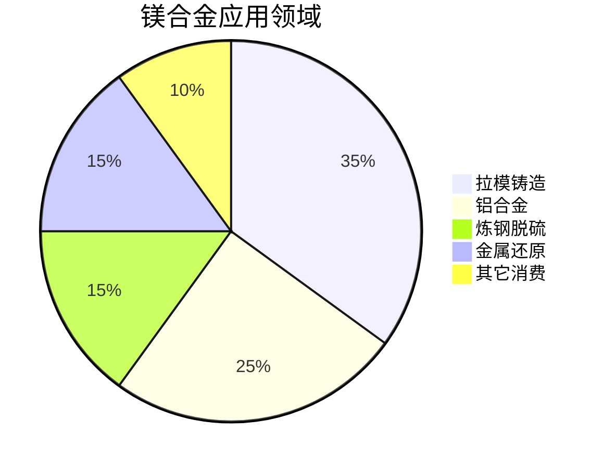
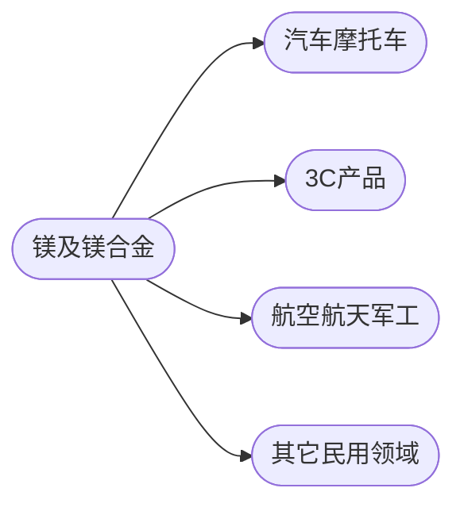

# 镁行业

[TOC]

## 产业链

### 矿藏分布

|地区|矿藏种类|储量|
|--|--|--|
|山西、河南、陕西、宁夏|白云石|中国储量40亿吨
|辽宁大石桥|菱镁矿|
|青海湖|水氯镁石、光卤石|氯化镁32亿吨，硫酸镁16亿吨
|俄罗斯|
|美国|
|以色列|
|哈萨克斯坦|
|巴西|
|马来西亚|

## 功能

镁合金应用领域

镁合金应用终端产品

## 产能分布

以色列死海镁业有限公司，电解氯化镁
俄罗斯索里卡姆斯克镁冶炼厂，电解氯化镁
哈萨克斯坦，AVISMA，电解氯化镁
巴西利马公司，皮江法
云海金属，10wt
天宇镁业，5wt
瑞格金属，
海镁特镁业
振鑫镁业
银光华盛,6.5wt
府谷京府，3wt
泰达煤化,2wt
傲天镁业
八达镁业
其它

### 云海金属

