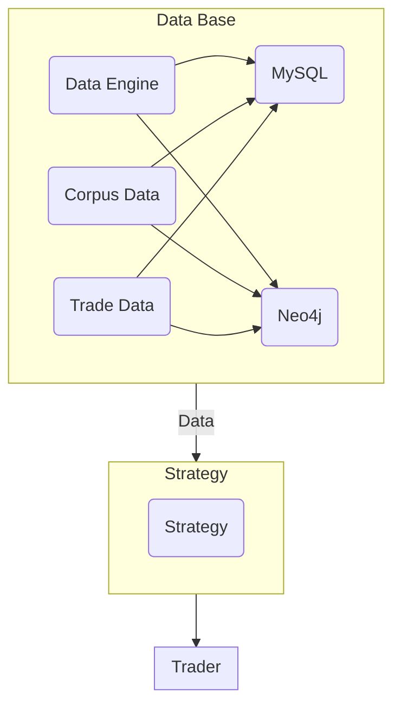
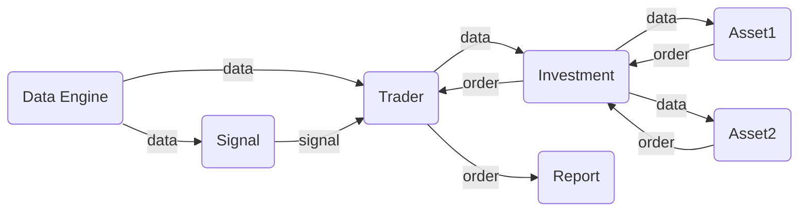

# Framework of Backtest

```mermaid
flowchart TB
    subgraph DB [Data Base]
        S1(Finance Data)
        S2(Corpus Data)
        S3(Trade Data)
        M1(MySQL)
        M2(Neo4j)
        S1-->M1
        S2-->M1
        S3-->M1
        S1-->M2
        S2-->M2
        S3-->M2   
    end
    subgraph E1 [Strategy]
        S4(Strategy)
    end
    subgraph E3 [Trader]
    end
    S1(Data Engine)
    DB-->|Data|E1
    E1-->E3
```

```mermaid
flowchart LR
    D(Data Engine)
    T(Trader)
    Sig(Signal)
    I(Investment)
    A1(Asset1)
    A2(Asset2)
    R(Report)
    D-->|data|T
    D-->|data|Sig
    Sig-->|signal|T
    T-->|data|I
    I-->|data|A1
    I-->|data|A2
    A2-->|order|I
    A1-->|order|I
    I-->|order|T
    T-->|order|R
```
