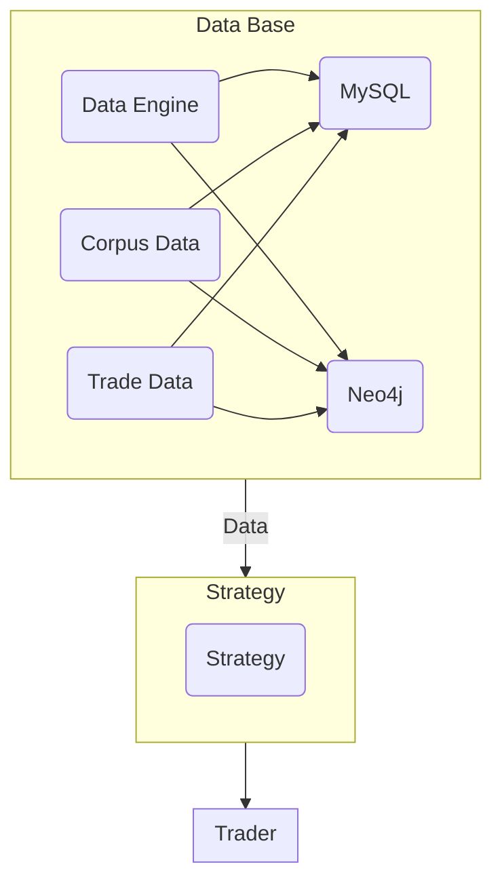
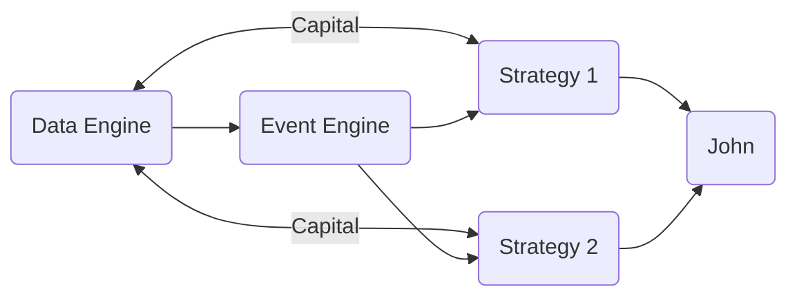

# Framework of Backtest

```mermaid
flowchart TB
    subgraph DB [Data Base]
        S1(Finance Data)
        S2(Corpus Data)
        S3(Trade Data)
        M1(MySQL)
        M2(Neo4j)
        S1-->M1
        S2-->M1
        S3-->M1
        S1-->M2
        S2-->M2
        S3-->M2   
    end
    subgraph E1 [Strategy]
        S4(Strategy)
    end
    subgraph E3 [Trader]
    end
    S1(Data Engine)
    DB-->|Data|E1
    E1-->E3
```

```mermaid
flowchart LR
    D(Data Engine)
    S1(Strategy 1)
    S2(Strategy 2)
    Trader(John)
    D<-->|Capital|S1
    D<-->|Capital|S2
    S1-->Trader
    S2-->Trader
    E(Event Engine)
    E-->S1
    E-->S2
    D-->E
```
