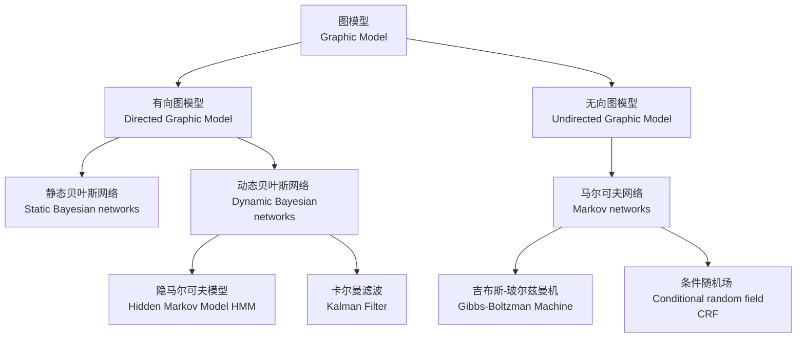

# 学习笔记

## 量化事件驱动策略的研究框架

## 概率图模型

```mermaid
graph TB
    A[图模型 <br/> Graphic Model]
    B[有向图模型 <br/> Directed Graphic Model]
    C[无向图模型 <br/> Undirected Graphic Model]
    D[静态贝叶斯网络 <br/> Static Bayesian networks]
    E[动态贝叶斯网络 <br/> Dynamic Bayesian networks]
    F[马尔可夫网络 <br/> Markov networks]
    G[隐马尔可夫模型 <br/> Hidden Markov Model HMM]
    H[卡尔曼滤波 <br/> Kalman Filter]
    I[吉布斯-玻尔兹曼机 <br/> Gibbs-Boltzman Machine]
    J[条件随机场 <br/> Conditional random field CRF]
    A --> B
    A --> C
    B --> D
    B --> E
    E --> G
    E --> H
    C --> F
    F --> I
    F --> J
```

```mermaid
graph TB
    subgraph Naive-Bayesian
        style Naive-Bayesian fill:#ffffff
            A(( ))
            B(( ))
            C(( ))
            D(( ))
            A --> B
            A --> C
            A --> D
            style A fill:#000000
            style B fill:#ffffff
            style C fill:#ffffff
            style D fill:#ffffff
            end

    subgraph HMM
        subgraph  
            E(( ))
            F(( ))
            G(( ))
            end
        subgraph  
            H(( ))
            I(( ))
            J(( ))
            end
        style E fill:#f9f
        style HMM fill:#ffffff
        end
```

# 央行利率工具

1. LFR 贷款市场报价利率 
2. MLF 中期借贷便利 

## linux用户管理

### Uid

Uid0超级用户，1~499是虚拟用户，500+普通用户
