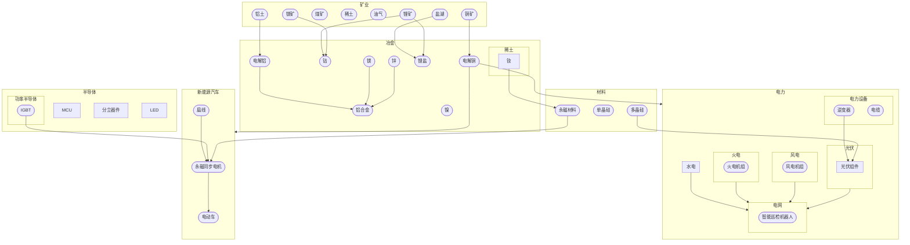

# 产业关系

```mermaid
flowchart TB
subgraph I1[电力]
    subgraph I1.1[水电]
    end
    subgraph I1.2[火电]
        p1.2([火电机组])
    end
    subgraph I1.3[风电]
        p1.1([风电机组])
    end
    subgraph I1.4[光伏]
        subgraph p1.3[光伏组件]
        end
    end
    subgraph I1.5[电网]
        p1.4([智能巡检机器人])
    end
    subgraph I1.6[电力设备]
        p1.7([逆变器])
        p1.8([电缆])
    end
    I1.1 & I1.2 & I1.3 & I1.4 --> I1.5
    p1.7-->p1.3
end
subgraph I2[新能源汽车]
    p2.1([永磁同步电机])
    p2.2([扁线])
    a4([电动车])
    p2.2-->p2.1-->a4
end
subgraph I3[半导体]
    subgraph I3.1[功率半导体]
        p3.1([IGBT])
    end
    p3.2[MCU]
    I3.3[分立器件]
    I3.4[LED]
end
p3.1-->p2.1
subgraph I6[矿业]
    k1([铝土])
    k2([铜矿])
    k3([煤矿])
    k4([稀土])
    k5([油气])
    k6([盐湖])
    k7([镁矿])
    k8([锂矿])
end
k8 & k7 --> m8
k2 --> m2
k1 --> m1
k6 & k8 --> m9
subgraph I4[冶金]
    m1([电解铝])
    m2([电解铜])
    m3([镁])
    m4([铝合金])
    m6([锌])
    m7([镍])
    m8([钴])
    m9([锂盐])
    m1 & m3 & m6-->m4
    subgraph I4.1[稀土]
        m5[钕]
    end
end
subgraph I5[材料]
    I5.1([永磁材料])
    I5.2([单晶硅])
    I5.3([多晶硅])
end
I5.3-->p1.3
m2-->I1 & I2
m5-->I5.1-->p2.1
```
