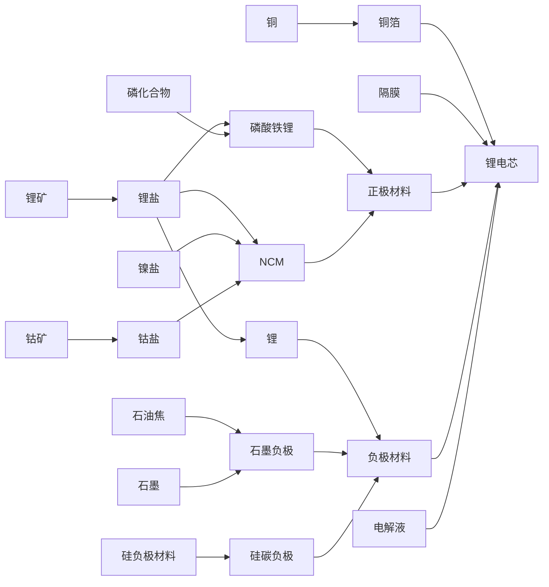
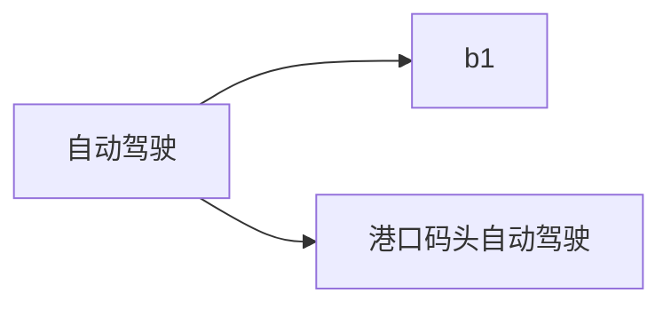
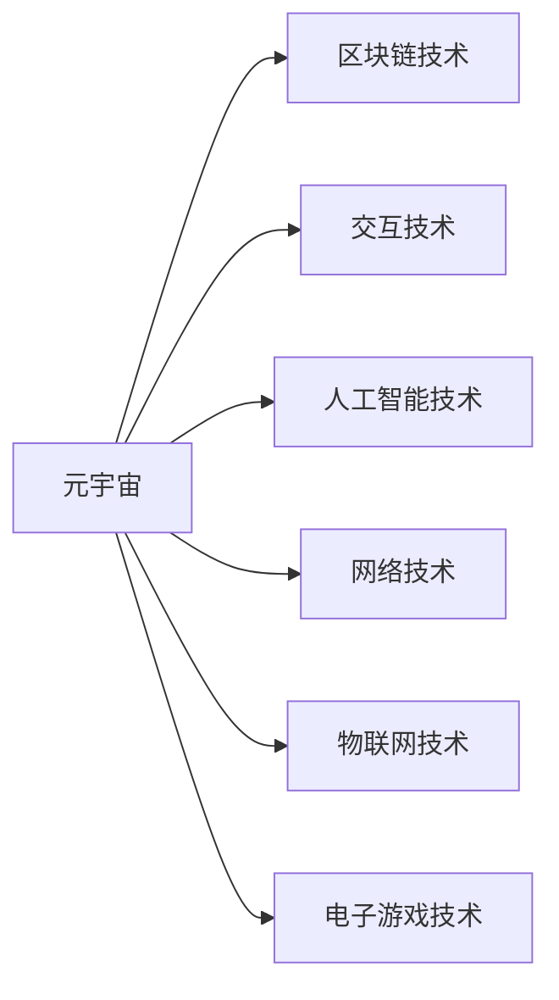

# Investment Graph

[TOC]

## Energy

### Hydrogen Energy

### Lithium

```mermaid
graph LR
a-->b1
b1-->c
b1-->c2
a1-->b2
b3-->c2
b2-->c2
b4-->c
b1-->b5
b5-->e4
c-->e3
c2-->e3
b6-->g
g-->f
e5-->f
e3-->f
e4-->f
e2-->f
h1-->h
h2-->h
h-->e4
h3-->h4
h4-->e4
a[锂矿]
a1[钴矿]
b1[锂盐]
b2[钴盐]
b3[镍盐]
b4[磷化合物]
b5[锂]
c[磷酸铁锂]
c2[NCM]
f[锂电芯]
e2[电解液]
e3[正极材料]
e4[负极材料]
e5[隔膜]
b6[铜]
g[铜箔]
h1[石油焦]
h2[石墨]
h3[硅负极材料]
h[石墨负极]
h4[硅碳负极]

```

## Technology

### Automatic Driving

```mermaid
graph LR
a --> b1
a --> b2
a[自动驾驶]
b2[港口码头自动驾驶]
```

### Metaverse

```mermaid
graph LR
a --> b1
a --> b2
a --> b3
a --> b4
a --> b5
a --> b6
a[元宇宙]
b1[区块链技术]
b2[交互技术]
b3[人工智能技术]
b4[网络技术]
b5[物联网技术]
b6[电子游戏技术]
```