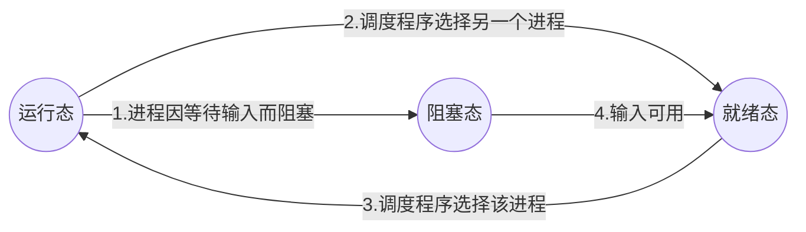

# Operation System

[TOC]

## 一、传统操作系统

### 1.操作系统概述

历史：

1. 第一代计算机(1945～1955):真空管和插线板
2. 第二代计算机(1955~1965):晶体管和批处理系统
3. 第三代计算机(1965~1980):集成电路芯片和多道程序
4. 第四代计算机(1980~1990):个人计算机

### 2.进程

进程模型

#### 进程的状态

#### 进程的实现

操作系统维护着一个结构数组进程表(process table)。进程表包含了进程的状态。每个IO终端都有中断向量，是中断服务程序的入口地址。

中断发生后，操作系统调度程序的工作步骤

1. 硬件(中断服务程序)压栈程序计数器
2. 硬件(中断服务程序)按中断向量更新的程序计数器
3. 汇编语言程序存储寄存器值
4. 汇编语言程序设置新的栈，将栈指针指向新的临时堆栈
5. C过程标识服务进程就绪
6. 调度程序决定哪个进程是下一个将运行的
7. C语言返回汇编代码
8. 汇编语言程序开始运行当前进程

#### 进程间通信

竞争条件：两个或多个进程读写某些共享数据，最后的结果取决与进程运行的精确时序，就称为竞争条件(race conditions)。

#### 经典的IPC问题
#### 进程调度

### 3.存储管理

无交换或分页的存储管理
交换
虚拟存储器
页表
分页硬件示例
相联存储器
页面置换算法
3.4页面置换算法……
75
3.4.1最优页面置换算法……
.5
3.4.2最近未使用页面置换算法.763.4.3先进先出页面置换算法.
76
34.4第二次机会页面置换算法…
77
3.4.5时钟页面置换算法………
...7
3.4.6最久未使用页面置换算法
78
3.4.7 用软件模拟LRU...
79

分页算法模型
3.5分页算法模型……
...80
3.5.1 Belady异常现象
80
3.5.2栈式算法……
81
3.5.3距离字符串……
82
3.5.4缺页率预测
83

3.6分页系统中的设计问题
83
3.6.1工作集模型…
83
3.6.2局部与全局分配策略
84
3.6.3页面尺寸……
86
3.6.4实现时涉及的问题
-86
3.7 分段……
89
3.7.1纯分段系统的实现…
91
3.7.2分段和分页结合: MULTICS .23.7.3分段和分页结合: Intel的386 .

### 4.文件系统

第4章文件系统……
.10
4.1 文件…………
.10
4.1.1文件命名 1014.1.2文件结构
102
4.13文件类型…
-103
4.14文件存取 104.15 文件属性
105
4.1.6文件操作…
100
4.17存储映像文件.104.2 目录
4.21层次目录系统
11о.110
4.22 略径名………
.1
4.2.3 目录操作………14.3文件系统的实现.113

113115117-11821

4.3.1实现文件43.2实现目录………4.3.3共享目录
4.3.4磁盘空间管理
4.3.5文件系统的可靠性4.3.6 文件系统性能…4.4安全性…4.4.1 安全环境……4.4.2著名的安全缺陷4.4.3 Interet虫.4.44一般的安全性攻击4.4.5安全性的设计原则4.4.6用户验证……4.5保护机制……4.5.1 保护域……
4.5.2 存取控制表…4.5.3 权限…………4.5.4保护模型4.5.5 隐藏通道4.6小结……习题……

### 5.I/O管理
第5章 1/0设备管理5.1 10硬件组成原理5.1.1 VO设备…5.1.2设备控制器
5.13直接存储器存取5.2 1O软件原理.
5.2.1 1O软件的目标5.2.2中断处理程序
5.2.3设备驱动程序 ……5.2.4与设备无关的10软件5.2.5用户空间的1/0软件..5.3磁盘 ……
5.3.1磁盘硬件5.3.2磁盘调度算法5.3.3磁盘出错处理
5.3.4 “每次一道”高速缓冲5.3.5 RAM盘54 附钟……………5.41时钟硬件 …
54.2 时钟软件………

26126127125130131132134134136137138139140

4314414514014614714814814915115115115315415415515156
VI

5.5端…15.1端硬件185.2存儲映像l端199.53输入软件1005.5.4 输H钦件 105.6 小习题..105
### 6.死锁
第6章 死锁…1676.1资源 .1676.2死铺定义….........1086.2.1 死销的条件16862.2 死锁模型.196.3鸵电算法……16.4死锁检测和恢复….1716.4.1单种资源类型下的死锡检测 .1716.4.2 多种资源类型下的死锁检测.1736.4.3从死锁恢复 1746.5死销避免..16.5.1资源轨迹图 1776.5.2 安全和不安全状态 176.5.3单种源的银行家算法..1786.5.4 多种资源的银行家算法.....1786.6死销预防…196.6.1破坏互斥条件...106.0.2破坏占有和等待条件.1806.6.3破坏不可剥夺条件 1806.6.4破坏循环等待条件 1806.7其他问题.….116.7.1两阶段加锁.1816.7.2非资源死锁 ....1826.7.3饥饿.1826.8 小结 182习题……………
### 7.UNIX
第7章实例研究1: UNIX .1857.1 UNIX的历史17.11 UNICS
85
7.1.2 PDP-11 UNIX
-.186
7.1.3可移植的UNIX.......167.14 伯克利UNIX..
.187
7.1.5 UNIX的标准化 1877.2 UNIX概述 189

7.2.1 设计目标7.2.2接口1907.2.3 录7.2.4 shell 197.2.5文件和目录..1937.26应用程序1947.3 UNX的一些基础概念1957.1 进程.167.3.2内存管理模式...1997.3.3文件系能 2007.3.4 10设备..20371.4 UNIX的系统调用 2057.4.1进程管理系统调用 .207.4.2内存管理系统调)..2087,4.3 有关文件和1录的系统调用 2087.4.4 1O系统调用 2097.5 UNIX的实现2097.5.1 进程的实现…2107.2 内存管理的实现..2127.5.3文件系统的实现….....2157.5.4 10实现…2177.6小结 ..218习题…219
### 8.MS-DOS
第8章实例研究2: MS-DOS 2218.1 MS-DOS的历史.2218.1.1 IBM PC2228.1.2 MS-DOS 1.0 22228.1.3 MS-DOS 2.02238.1.4 MS-DOS 3.02238.1.5 MS-DOS 4.02248.1.6 MS-DOS 5.0228.2 MS-DOS慨述.2258.2.1使用.2268.2.2 shell8.2.3 配置.2298.3 MS-DOS的基本概念 2308.3.1进程 2308.3.2 内存模式
-.233
8.3.3 文件系统.2408.3.4 1/O设备……
……241
8.4 MS-DOS的系统调用.242

VII

8.41进程管理系统调用2438.42内存管理系统调用.24384.3 文体与口录系统调用..248.44 10系统调用.…248.5 MS-DOS的实现 248.51进程的实现.2498.5.2内存管理的实现 248.5.3文件系统的实现 2478.5.4 10的实现..2.08.6小结 2.2习题……25
### 9.Linux
## 二、分布式操作系统
### 10.分布式操作系统概述
第二部分分布式操作系统
第9章 分布式操作系统概述….259.1目标…..9.11 分布式系统相对于集中式系统
的优点..2559.1.2分布式系统相对于独立PC机
的优点…......2.69.1.3分布式系统的缺点..25792硬件上的概念…2.589.2.1总线型多处理机…259.2.2交换型多处理机 26092.3总线型多计算机……………26192.4交换型多计算机.2029.3软件上的概念.…293.1网络操作系能和网络文件系统.26039.3.2真正的分布式系统..2699.3.3多处理机分附系能 .20994 设计上的考虑……2794.1透明性....21942具活性
………………273
9.4.3 可靠性…274944性能……
279
94.5可扩展性.2709.5小错 27引题 277
### 11.分布式系统中通信问题
第10章分布或系统中的通信问题 27410.1分层协议.2751011 物理层
10.1.2 数链路层2-281

10.1.3网络层 28210.14 传输层.28310.1.5 会话层2.8310.1.6表示层.......28310.1.7 应用28410.2客户-服务器模型 28410.2.1客户和服务器.28410.2.2个客户和服务器的实例 .28510.2.3录址 28810.2.4阻塞与非阻塞原语……
.289
10.2.5级冲和非级冲原语
291
10.2.6可靠和不可靠原语…29310.2.7实现客户-服务器模型 29410.3远程过程调用 ...
295
10.3.1 基本的RPC操作.
.296
10.3.2 参数传递..
298
10.3.3 动态联编
-30,
10.3.4 出现差错时的RPC语义.30310.3.5与实现相关的论题……..
300
10.3.6问题域…
315
10.4组通信.…
319
10.4.1组通信入门…
315
10.4.2与设计有关的问题
-316
10.4.3 ISIS中的组通信…
322
10.5 小结…
324
题...
..2
### 12.分布式系统中的同步
第11章 分布式系统中的同步
-327
11.1时钟同步 .
327
11.1.1逻辑时钟…………11.1.2 物理时钟……
…328…33
11.3时钟同步算法.
．．
……33
11.2 互斥…33611.2.1集中式算法.3611.2.2分布式算法
11.2.3令牌环算法…
…………3337…39
11.2.4三种算法的比较.34011.3选举算法
………34
11.3.1 Bully法 34111.3.2 环算法11.14原子事务
…342
…343
11.41原子事务简介 34
1X

11.2 事务模型.3411.4.3现34711.4.4年发控制..35011.5分布式系统巾的死锁.35211.5.1分布式死锁的检测…35311.5.2分布式死锁的预防………611.6 小3.57习题…………………
### 13.分布式系统中的进程及处理器
第12章 分布式系统中的进程及
处理器.…………………12.1 线程…
........559
12.1.1线程的引人………12.1.2线程使用.36012.1.3线程包的设计问题..36212.1.4 线程包的实现.36512.1.5 线程和RPC.....
.......67
12.16一个线程包的例子
......8
12.2 系统模型……
....371
12.2.1工作模…
….371
12.2.2使用空闲工作站.312.2.3处理器池模型…3712.2.4混合模型 3712.3处理器分配 .37812.3.1分配模型…378123.2处理器分配算法的设计原则…38012.3.3处理器分配算法的实现问题 3812.3.4处理器分配算法实例…3212.4分布式系统中的调度 3812.5 小绪…………………82习题………
387
### 14.分布式文件系统
第13章 分布式文件系统
389
13.1 分布式文件系统设计
….89
13.1文件服务的接口…
389
13.12 目录服务器接口…
391
13.1.3文件共享的语义……
394
13.2 分布式文件系统的实现
396
13.2.1文件的使用…
396
13.22 系统结构……
397
13.2.3缓存区处理…
400
13.2.4复制性-
404
13.2.5 例子: Andrew文件系统
407

13.2.6 经验教训..4113.3 分布式文件系统的发展趋势.41213.3.1 新的硬件…………41213.3.2 可伸缩性
……………414
13.3.3 广城网……………41413.3.4移动用户…1513.3.5容错…......415134小结 415习题.………………416
### 15.AMOEBA
第14章 实例研究3: AMOEBA 41814.1 Amoeba简介..41814.1 Amoeba的历史 41814.1.2 研究目的 41814.1.3 Amoeba的体系结构 41914.1.4 Amoeba微内核 42014.1.5 Amoeba服务程序...
422
14.2 Amoeba中的对象与权限字.42214.2.1权限字....
423
14.2.2对象的保护…………
..424
14.2.3标准操作.……
....
425
14.3 Amoeba中的进程管理
425
14.3.1进程…...
..426
14.3.2 线程…
427
14.4 Amoeba的内存管理
428
14.4.1段的管理………
428
14.2段的映像……
429
14.5 Amoeba的通信…
429
14.5.1远程过程调用
430
14.5.2 Amoeba的组通信
..
..432
14.5.3快速局域网协议
…438
14.6 Amoeba服务器
1443
14.6.1文件服务器
443
14.6.2 目录服务器
446
14.6.3复制服务器
..449
14.6.4运行服务器
.449
14.6.5 引导服务器 45114.6.6 ТСР/Р服务器45114.6.7其他服务器 45114.7 小结……………
1451
可题……
……………452

### 16.Mach